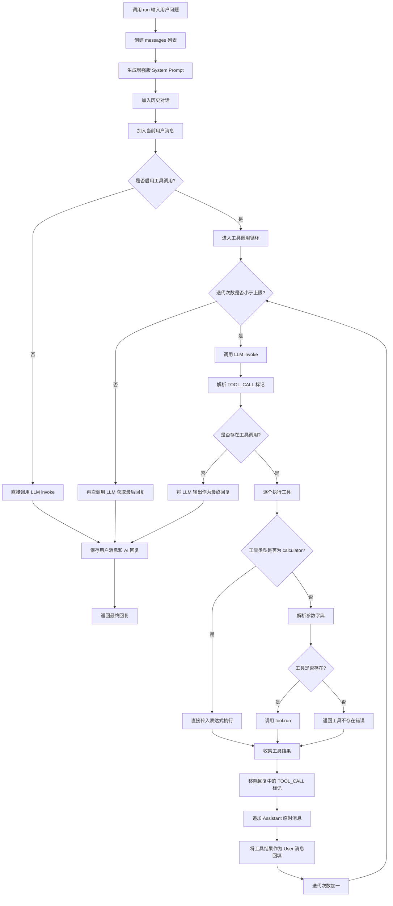

```mermaid
flowchart TD
    A[调用 run 输入用户问题] --> B[创建 messages 列表]
    B --> C[生成增强版 System Prompt]
    C --> D[加入历史对话]
    D --> E[加入当前用户消息]
    E --> F{是否启用工具调用?}

    F -- 否 --> G[直接调用 LLM invoke]
    G --> H[保存用户消息和 AI 回复]
    H --> I[返回最终回复]

    F -- 是 --> J[进入工具调用循环]
    J --> K{迭代次数是否小于上限?}

    K -- 否 --> L[再次调用 LLM 获取最后回复]
    L --> H

    K -- 是 --> M[调用 LLM invoke]
    M --> N[解析 TOOL_CALL 标记]
    N --> O{是否存在工具调用?}

    O -- 否 --> P[将 LLM 输出作为最终回复]
    P --> H

    O -- 是 --> Q[逐个执行工具]
    Q --> R{工具类型是否为 calculator?}

    R -- 是 --> S[直接传入表达式执行]
    R -- 否 --> T[解析参数字典]
    T --> U{工具是否存在?}
    U -- 否 --> V[返回工具不存在错误]
    U -- 是 --> W[调用 tool.run]

    S --> X[收集工具结果]
    W --> X
    V --> X
    X --> Y[移除回复中的 TOOL_CALL 标记]
    Y --> Z[追加 Assistant 临时消息]
    Z --> AA[将工具结果作为 User 消息回填]
    AA --> AB[迭代次数加一]
    AB --> K
```